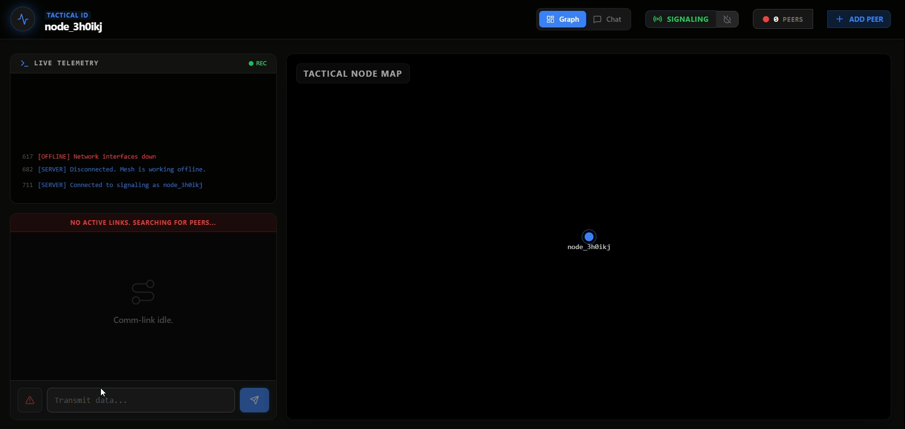
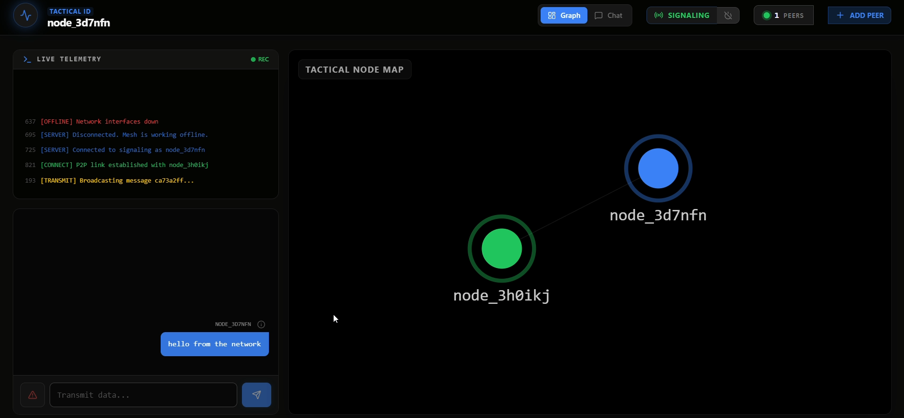
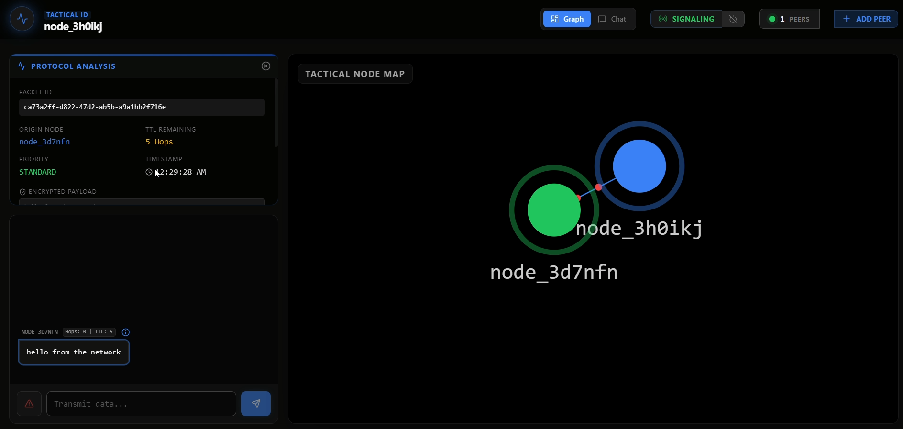
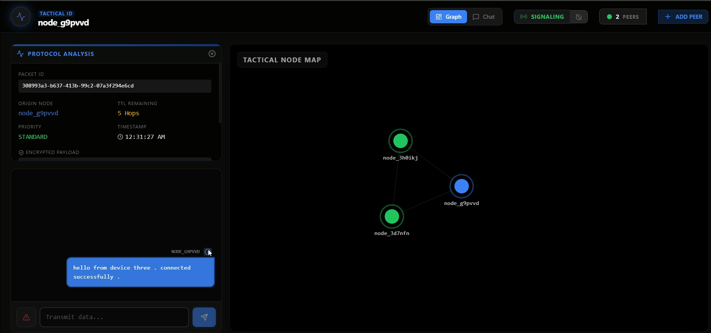
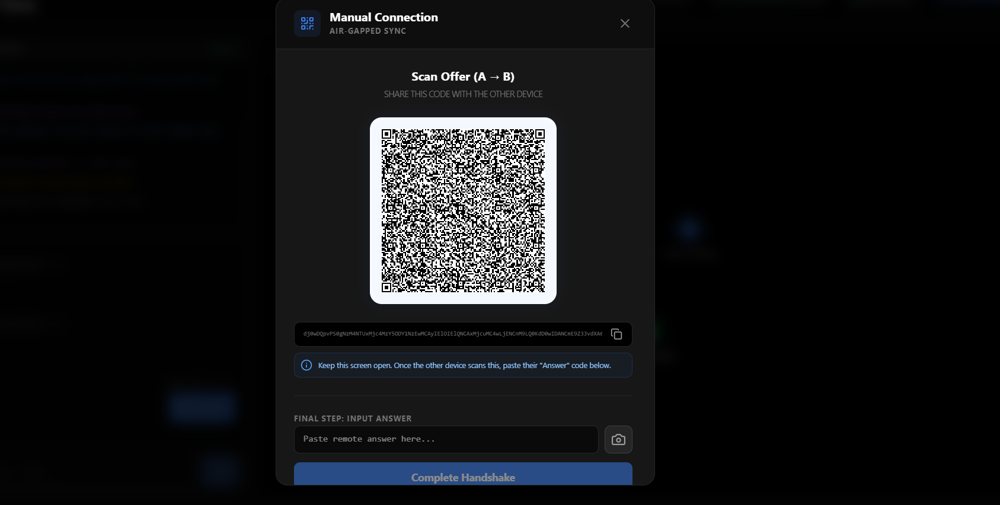
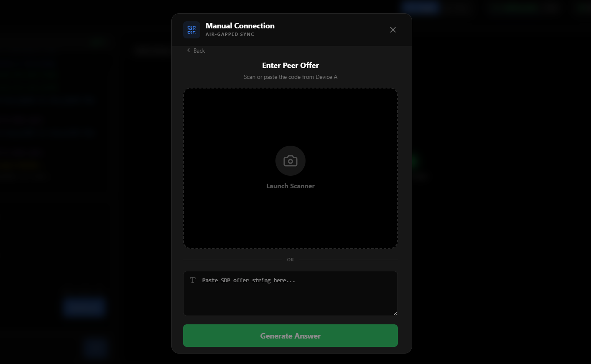
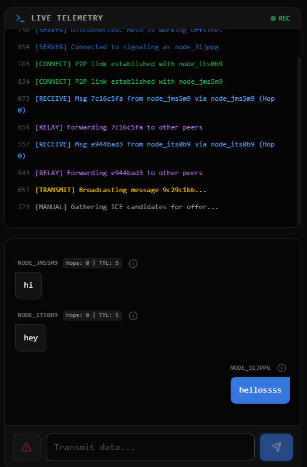

# Silent Network

A decentralized, peer-to-peer mesh communication system that enables devices to exchange messages without internet or central servers. Designed for low-connectivity, restricted, or fully offline environments, Silent Network forms a self-sustaining communication layer using direct device-to-device connections.

---

## Overview

Silent Network reimagines communication using a Web3-inspired, decentralized approach. Instead of relying on traditional infrastructure like ISPs or centralized servers, each device becomes both a user and a relay node, forming a dynamic mesh network.

Messages propagate across the network using controlled routing mechanisms, ensuring communication remains active even when connectivity is unreliable or unavailable.

---

## Key Features

- Decentralized Mesh Networking – No central server dependency after initial connection  
- WebRTC Data Channels – Secure, low-latency peer-to-peer communication  
- Self-Healing Network – Automatically reroutes messages when nodes disconnect  
- Real-Time Topology Visualization – Interactive graph showing nodes and message flow  
- Air-Gapped Connectivity – Offline peer connection using Base64 SDP exchange  
- QR-Based Peer Sync – Connect devices by scanning QR codes without internet  
- Custom Routing Protocol – TTL-based propagation with deduplication to prevent loops  
- Network Telemetry Logs – Live system-level activity tracking  

---

## Tech Stack

**Frontend**
- React (Vite)
- Zustand (State Management)
- react-force-graph-2d (D3-based visualization)
- TailwindCSS

**Backend (Signaling Only)**
- Node.js
- Express
- WebSocket (`ws`)

**Core Technologies**
- WebRTC (RTCPeerConnection, RTCDataChannel)
- SDP & ICE Candidate Exchange
- Gossip-based Mesh Routing
- Cryptographic Message Identification (UUID + Deduplication)

---

## How It Works

1. A node connects to the signaling server for peer discovery  
2. WebRTC handshake establishes direct P2P connections  
3. DataChannels open → network becomes fully decentralized  
4. Messages propagate across nodes using controlled flooding (TTL)  
5. Nodes track seen messages to prevent duplication  
6. Network dynamically adapts as nodes join/leave  

---

## Getting Started

### Prerequisites
- Node.js
- npm

---

### 1. Install Dependencies

```bash
npm run install:all
```
*(This automatically installs packages for the root project, the `/server` folder, and the `/client` folder).*

### 2. Start the Development Servers
In the exact same root folder, run:
```bash
npm run dev
```

### What Happens When You Run That?
The `npm run dev` script launches `concurrently` which starts:
1. **Backend:** The WebSocket signaling server on port `3001` (used exclusively for initial peer discovery).
2. **Frontend:** The Vite React app on `http://localhost:port`.

### 3. Open the Dashboard to Test
To actually see the mesh network working, you **must open multiple browser tabs**.
1. Open Google Chrome or Edge.
2. Navigate to [http://localhost:port](http://localhost:port).
3. Open a **second** and **third** tab to the exact same URL. 

The nodes will automatically discover each other through the signaling server and construct WebRTC P2P Data Channels. You will see the Force Graph construct itself, and you can test sending messages between tabs to observe the red data packets traversing the graph!

## Screenshots

Below is a visual overview of the Silent Network interface and features:

### 1. Initial State (Idle)
The system searching for peers before a connection is established.


### 2. Manual Air-Gapped Sync
Establishing a connection entirely offline using a QR code and Base64 SDP strings.


### 3. P2P Link Established & Packet Inspection
Two nodes connected with active protocol analysis and data packet transmission.


### 4. Mesh Network Topology
A multi-node tactical mesh mapping real-time connections and message cascades.


### 5. Multi-Peer Communication
Scaling the mesh dynamically with incoming peers.


### 6. Topology Update
System adapting as connections fluctuate.


### 7. Global Node Map
The unified picture of the operational mesh.

